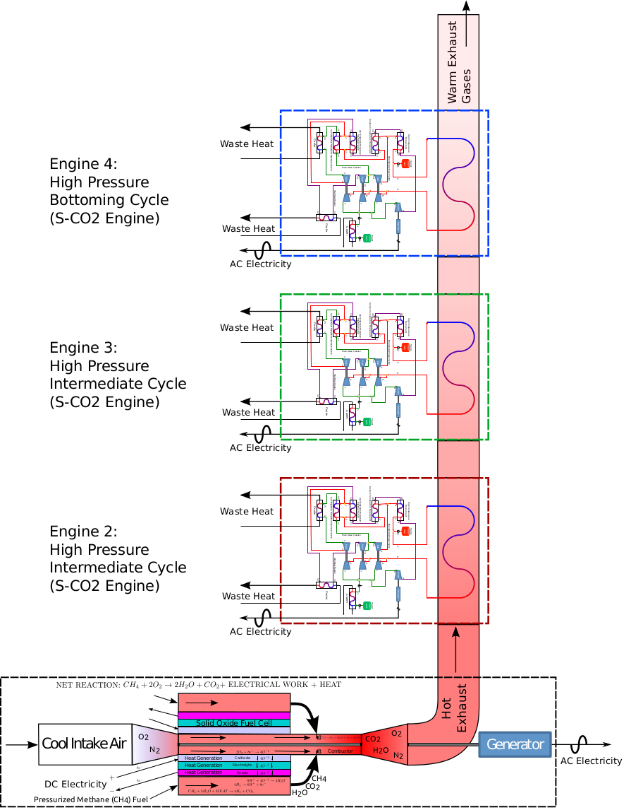

# Real Fluid Heat Engine Cycle Analysis Code #

________________________________________________________________

# This software was created as a part of the doctoral dissertation [A Study of Power Cycles Using Supercritical Carbon Dioxide as the Working Fluid](http://andyschroder.com/static/pdf/CO2Cycle/AndySchroder-DoctoralDissertation-paper.pdf) #

by [Andy Schroder](http://AndySchroder.com), and was conducted along with research advisor Mark G. Turner at the [Gas Turbine Simulation Laboratory](http://gtsl.ase.uc.edu/) of the University of Cincinnati.

________________________________________________________________

The software's primary use is for 0-D thermodynamic cycle analysis, however, there are also some scripts included for pre and post processing necessary for the STAR-CCM+ 2-D conjugate heat transfer simulations that were included in the dissertation.

It is strongly encouraged to review the dissertation prior to attempting to use this software.

  
  
________________________________________________________________

  
  
________________________________________________________________

## Style Notes ##

- The code is written in Python.
- There are some formatting/style issues that could be considered non-standard.
   - Indentations utilize tabs rather than a series of spaces.
   - A tab is assumed to be equivalent to 8 characters.
   - Lines are also often times over 300 characters long, rather than 80 characters which is used by some programmers. This assumes you are using a high resolution screen.
   - Comments that are not indented with the code that they accompany are usually done so to stand out and indicate some deficiency, simplification, or assumption that could be improved.
   - `docstrings` are not used, but extensive comments are provided throughout the code.
   - `SmartDictionary` objects are used instead of classes. This may have been an amateur programmer's flaw, but it works. The `SmartDictionary` object is just a dictionary which does not require sub dictionaries to be explicitly defined before referencing them. `SmartDictionary` objects are used extensively to hierarchically store component information.

  
  
________________________________________________________________

## Installation ##

### Note: This software has been tested with ubuntu 14.04. Installation instructions are only provided for this Linux distribution and release. ###

1. Install dependencies
   * `sudo apt-get update`
   * `sudo apt-get install python-numpy python-scipy python-matplotlib python-pip git ipython`
   * `sudo pip install joblib==0.8.4`
2. Clone this repository if you have not already done so:
   * `git clone https://github.com/AndySchroder/CycleCode`
3. Install REFPROP related files:
   * See notes below about REFPROP folders regarding what to do.
4. See notes below about `RunLauncher`, `RunFiles`, and `InputParameters` for some instructions on how to use this software once installed.

  
  
________________________________________________________________

## File Structure ##

Ordered from highest to lowest level.

### Thermodynamic Cycle Analysis ###

### `GetOptimizedCycleDetails.py` ###
- Simple stand alone script used to extract some useful parameters from the results file from the optimized cycle.

### `PlotResults.py` ###
- Stand alone script used to generate plots from cycle and combined cycle runs presented in the dissertation.
- Assumes all cases in `RunFiles` have been run. If not, comment out the cases you have not yet run.
- Need to change the variable `BaseOutputFilePath` to something meaningful before running (currently set to `/tmp/`).

### `PlotSomeHeatExchangers.py` ###
- Stand alone script used to generate the 0-D heat exchanger solution plots presented in the dissertation
- Need to change the variable `BaseOutputFilePath` to something meaningful before running (currently set to `/tmp/`).

### `RunLauncher` ###
- BASH script to launch a run defined in `RunFiles/`
- Usage: `./RunLauncher RunFileBaseName`, from the root of the repository for a run file such as `RunFiles/RunFileBaseName.py`

### `RunFiles/*.py` ###
- These are stand alone run files for all cases presented in the dissertation, as well as a few extra.
- Run files are python scripts that define variables needed for a case and then run the appropriate function for that case.
- The output folder for these cases defined in `ParallelCycles.py` in a few places is `outputs/`.
- For cases where `ParallelCycles.py` is not used, the output usually goes to `scratch/`.
- In parallel run files, the value of `ParallelCycles.NumberOfCPUs` has been set to `2` so that you can get running without needing a high performance workstation (each parallel process uses additional memory, so too much parallelization without sufficient computing hardware could result in RAM being exhausted on your system and processes beginning to crash, in addition to just slowing down your system).
  - Tip: If you want quickly change all parallel run files to use more CPUs, run a command such as `sed -i 's/ParallelCycles.NumberOfCPUs=2/ParallelCycles.NumberOfCPUs=5/g' *` from within the `RunFiles` folder.
  - Note: If you have a very large number of CPUs available on your workstation, check to make sure that you aren't over allocating CPUs to a run. For example, `CombinedCycle-OptimizedParameterSweep-NumberOfEngines.py` needs a maximum of `6` CPUs because there are only `6` permutations conducted in it.
- Some `RunFiles` do a little post processing too.

### `InputParameters/*.py` ###
- Has some default engine parameters for the general CO2 cycle, simple air brayton cycle, as well as the constant volume CO2 cycle. Each cycles' python function references a specific `InputParameters` file.
- These are utilized with the python `execfile` function in order to allow them to be merged with the specific values defined in the `RunFiles` as well as parameter sweep permutations. Not sure if this is the best way to do such a thing, but it works. These files basically function like an include file in other programming languages.

### `ParallelCycles.py` ###
- Implements parallel design exploration and optimization as well as combined cycle engine configurations.
- Design explorer and optimizers are setup for both the single cycle as well as the combined cycle configuration.

### `Cycles.py` ###
- Overall single cycle analysis functions.
- Function descriptions:
  - `PreCompressionReCompressionCycleWithReheat`: General cycle studied with recuperation and flow splits. Used for CO2 engines. Some heat exchangers may not be present based on the pressure ratios defined. Unknown pressure ratios (low temperature recuperator low pressure side, low temperature medium pressure cooler, power turbine, and recompressor) are iterated for using a very simple convergence process. Conserves energy of all components in the cycle. Determines inlet and outlet conditions of all components (compressors, turbines, heaters, coolers, recuperators).
  - `SimpleCycle`: Simple brayton cycle with no reheat, precompression, recuperation, or flow splits. Used for open loop engines. This function was derived from `PreCompressionReCompressionCycleWithReheat`. This function also implements a hybrid engine that uses a fuel cell as a pre-heater prior to combustion.
  - `ConstantVolumeCycle`: Recuperated Lenoir cycle with no reheat, precompression, or flow splits. Used for CO2 engines. This function was derived from `PreCompressionReCompressionCycleWithReheat`.

### `Components.py` ###
- Implements functions for all components used by `Cycles.py`
- `GeneralRealRecuperator` from `HeatExchangers.py` is imported into this module.

### `HeatExchangers.py` ###
- 0-D real fluid heat exchanger functions. Currently using with carbon dioxide above the critical temperature, although could be easily re-worked to use with other real fluids with no discontinuous phase changes (it may already work fine with other fluids, it just has not been tested or reviewed).
- Allows for any combination of boundary conditions, except as noted below when used in constant volume heating mode.
- This is the most complex and slowest portion of the code.
- Much of the complexity is due to the lack of a mixing model and the necessity to implement small heaters and coolers in order for equal temperatures at the flow recombinations.
- There is also some logic in this file that is for the most part inactive after further enhancements were made:
  - The function `RealRecuperator` is a wrapper function for the function `RealRecuperatorIteration`, however, `RealRecuperator` only conducts 1 iteration now, so it can be eliminated. This was originally intended to iterate over the values of `SpecificHeatRatios`, which is no longer needed.
  - There is also some logic in the function `RealRecuperatorIteration` that loops through several pinch locations using a dumb trial and error approach if the initially guessed location based on heuristics fails. This begins with `for trial in arange(0,4):` and is then controlled by the logic where `CalculationType`, `PreviousCalculationType`, `Previousindex`, and `index` are tested at the end of the loop and a new pinch location suggested for the next iteration. This loop and control logic are no longer needed because the root finding of the `SolveRecuperator` function will always result in the correct pinch location being found. The root finder is just a little less efficient if the initially guessed pinch location using the heuristics fails. Therefor, the loop initiated by `for trial in arange(0,4):` will always be exited after the first iteration.
- The heat exchanger can implement a theoretical constant volume heating on the high pressure, heated side. This introduces much complexity. The applicability of the constant volume heating mode when the small heaters or coolers are implemented is likely incorrect. The `RealRecuperatorIteration` function is designed such that it should be able to accept different combinations of boundary conditions other than constraining the low pressure inlet and high pressure inlet, however, those other boundary conditions were not tested since there was no need and would only be useful if the small heaters and coolers were properly implemented in order to avoid the cycle to not be improperly constrained. The `HighPressureEnergy` variable is used throughout the `RealRecuperatorIteration` function in order to control whether constant volume or constant pressure heating is happening. Constant volume cooling on the low pressure, cooled side is not implemented in any way.
- Function descriptions:
  - `GeneralRealRecuperator`: Highest level function. Needed to solve for the unknown pressure drops (or rises) in the high and low pressure sides of the heat exchanger. A very simple iterative convergence process is used. As mentioned in the dissertation, a linear pressure drop which is a function of temperature drop is assumed. This is a simplification and could be improved in many ways.
  - `RealRecuperatorWithHeatOrCool`: Called by `GeneralRealRecuperator`. Used to determine what heaters and coolers (if any) are required at the inlets and outlets based on the boundary conditions given. Calculates heating at the high pressure exit and cooling and the low pressure exit. Defers calculating of the heating at the high pressure inlet and cooling at the low pressure inlet to be done by `RealRecuperatorIteration`.
  - `RealRecuperator`: Calls `RealRecuperatorIteration`. As mentioned above, this wrapper function should probably be eliminated.
  - `RealRecuperatorIteration`: The primary heat exchanger function. Calls scipy.optimize.root which then calls `SolveRecuperator`.
  - `SolveRecuperator`: Discretized heat exchanger which is called by `scipy.optimize.root` and `RealRecuperatorIteration`. Returns whether the inputs supplied resulted in the minimum temperature differences that was defined or returns the solution if not called by `scipy.optimize.root`, but instead called directly with a known good set of boundary conditions after running with `scipy.optimize.root`.

### `ComponentPreliminaryDesign.py` ###
- Used to calculate a few parameters relevant to component design.
- For the most part, these functions are buggy over wide fluid property ranges and their use has been removed from most parts of the code instead of improving them.
- The use of these functions has have been removed from most of `Cycles.py` so that these parameters will not be computed for every single case/permutation since they slow down computation. It's preferred to use these functions only after a good design has been found by the optimizer since you won't even care about component characteristics for bad designs anyway.

### `Plotters.py` ###
- Plotting functions for both cycle layouts (such as T-s, h-s, p-V, p-T diagrams) and 0-D heat exchangers and parameter sweeps
- General plotting helper functions are also included in this file.

### `_differentialevolution.py` ###
- Slightly modified SciPy module.
- This file maintains a separate copyright and license.

### `FluidProperties/REFPROP/__init__.py` ###
- Many wrapper functions created to deal with the python REFPROP module.
   - See below for installation notes on the python REFPROP module.
- There are also some functions in here to deal with fuel cell and combustion chemistry. In these cases the enthalpy of formation does not come from REFPROP.
- All function inputs and outputs use base SI units and masses instead of molar values and kilo values which REFPROP uses.
- Some functions are vectorized for use with arrays as inputs. There are many different functions for different input variable combinations and output variables.
- Some commonly used values are pre-populated and interpolation functions used instead of a vectorized version of the direct call to REFPROP.
- This file takes several minutes to pre-populate the interpolation functions. After the first run, those interpolation functions are dumped to files and can be re-read on the next restart of the python interpreter instead of regenerated, however, it still takes about 30 seconds to re-read upon the next launch. This property load time has impacted much of design/structure of the entire cycle analysis code.
- A non-vectorized function called `GetFluidProperties` accepts a number of input combinations and then returns multiple properties at that given state as a dictionary.
- The `SetupFluid` function can be used to change the fluid that is used. However, there are currently some limitations with this not changing everything, so need to read through the comments to learn what you cannot use once the fluid type is changed.
- Fluids allowed are currently limited to ones that are hard coded in. This is because of some issues with mixture species concentrations needing to he hard coded and didn't make a general way to deal with this easily.

### `FluidProperties/REFPROP/PyREFPROP/` ###
- Expected location to clone the python-refprop module to. To do so, use the following commands, starting from the root of the repository:
   * `cd FluidProperties/REFPROP/`
   * `git clone https://github.com/AndySchroder/python-refprop PyREFPROP`
- You will need to follow the installation instructions in the `README` file in the `PyREFPROP` folder in order to compile the fortran code that you place in `FluidProperties/REFPROP/REFPROPSource/` (see below). The `rp2so` script that it tells you to run will be expecting the source files to be there.
- When you run the `rp2so` script, the compiled files will be placed into `FluidProperties/REFPROP/REFPROPBinaries/`. This path is conveniently searched by the `PyREFPROP/python2x/refprop.py` file, so you actually don't need to install into the python `dist-packages` folder like the `README` file suggests.
- Confusing points, areas for future simplification:
   * This repository includes a python 3 version of the module created by the original author(s) of the module, although I have not tested it or ever used it.
   * This repository also includes `equipment.py` and `multiRP.py` from them, which are not used either.
   * Currently git submodules and other alternatives are not used for this repository inside of a repository. It may have been better to do so, but for now you will have to manually clone this additional repository. As a result, the `PyREFPROP` folder is set in the `.gitignore` file and you will have to separately track any changes you make to this repository.

### `FluidProperties/REFPROP/REFPROPSource/` ###
- In this folder you should place your `fluid`, `mixture`, and `fortran` folders that you get after you pay your tax to NIST to receive a copy of REFPROP.
- These folders will be in the installation folder when you install the REFPROP GUI.
- You will have to do this installation on a windows machine since the the installation executable only runs on windows. You may want to use VirtualBox for this task.
- Once you have copied these folders to your Linux workstation, you no longer need the windows system anymore and you do not need the windows GUI either.
- Since these files are copyright the United States Secretary of Commerce and are excluded by the Freedom of Information Act by The Standard Reference Data Act, they may not be redistributed by other parties. In order to avoid accidentally doing this, the repository's `.gitignore` includes this directory so that it will be ignored by git. The same thing goes for the `REFPROPBinaries` folder.

### `helpers.py` ###
- Simple general purpose helper functions that really have nothing specific about them to thermodynamic cycle analysis.
- Many of these functions are useful for other types of analysis and extend or slightly change the way some very standard python numpy functions work.

### Pre and Post Processing for STAR-CCM+ 2-D Conjugate Heat Transfer Simulations ###

These files are higher level than many of the above lower level files, but are separated here since they have nothing to do with thermodynamic cycle analysis.

### `GenerateSTAR-CCMPropertyTables.py` ###
- Stand alone script used to generate property tables from REFPROP that can be imported into STAR-CCM+ to allow it to do real gas calculations.
- Several property table resolutions are generated.
- At the beginning of the file you need to define the temperature and pressure ranges for the data that you would like to generate. There is are two examples already in the file that were used (one has been commented out).
- Just prior to releasing this script, STAR-CCM+ added the option in a new release to optionally also include entropy tables. This script does not currently generate entropy tables, although it wouldn't be hard to add such a feature.

### `HeatExchangerCFDPreProcess.py` and `HeatExchangerCFDPreProcess-LowPressure.py` ###
- Compute mass fluxes, given high and low pressure inlet temperatures and pressures, and the high pressure mass fraction, for various Reynolds numbers (based on the channel hydraulic diameter).

### `ExportCFDy+csvFiles.py` ###
- Stand alone script used to launch STAR-CCM+ with a series of files and extract y+ data using `ExportCFDyPluscsvFiles.java`
- You will need to edit this file to include you appropriate license information in the command line in place of `YourPODKeyHERE!`.

### `ExportCFDyPluscsvFiles.java` ###
- Very short java code to use in STAR-CCM+ to automatically export y+ data.

### `ExportCFDcsvFiles.py` ###
- Stand alone script used to launch STAR-CCM+ with a series of files and extract data using `ExportCFDcsvFiles.java`
- You will need to edit this file to include you appropriate license information in the command line in place of `YourPODKeyHERE!`.

### `ExportCFDcsvFiles.java` ###
- Short java code to export some data from STAR-CCM+ to csv files.

### `HeatExchangerCFDPostProcess.py` ###
- Stand alone script that uses functions in `HeatExchangerCFDPostProcessFunctions.py` to post process data from STAR-CCM+ runs and make the plots found in the dissertation related to the 2-D conjugate heat transfer.
- Need to change the variables `HeatExchangerCFDPostProcessFunctions.BaseDirectory` and `OutputDirectory` to something meaningful before running (currently set to `/tmp/`).

### `HeatExchangerCFDPostProcessFunctions.py` ###
- Functions used to process data exported from STAR-CCM+

  
  
________________________________________________________________

## Copyright ##

Copyright (c) 2016, [Andy Schroder](http://AndySchroder.com)

## License ##

Permission is hereby granted, free of charge, to any person obtaining a copy of this software and associated documentation files (the "Software"), to deal in the Software without restriction, including without limitation the rights to use, copy, modify, merge, publish, distribute, sublicense, and/or sell copies of the Software, and to permit persons to whom the Software is furnished to do so, subject to the following conditions:

The above copyright notice and this permission notice shall be included in all copies or substantial portions of the Software.

THE SOFTWARE IS PROVIDED "AS IS", WITHOUT WARRANTY OF ANY KIND, EXPRESS OR IMPLIED, INCLUDING BUT NOT LIMITED TO THE WARRANTIES OF MERCHANTABILITY, FITNESS FOR A PARTICULAR PURPOSE, AND NONINFRINGEMENT. IN NO EVENT SHALL THE AUTHORS OR COPYRIGHT HOLDERS BE LIABLE FOR ANY CLAIM, DAMAGES OR OTHER LIABILITY, WHETHER IN AN ACTION OF CONTRACT, TORT, OR OTHERWISE, ARISING FROM, OUT OF OR IN CONNECTION WITH THE SOFTWARE OR THE USE OR OTHER DEALINGS IN THE SOFTWARE.

  
  
________________________________________________________________

## Other Derived Work ##
#### The modified version of `_differentialevolution.py`, which is part of [SciPy](https://scipy.org/), maintains the following [copyright and license](https://scipy.org/scipylib/license.html): ####

SciPy license

Copyright 2001, 2002 Enthought, Inc.
All rights reserved.

Copyright 2003-2013 SciPy Developers.
All rights reserved.

Redistribution and use in source and binary forms, with or without modification, are permitted provided that the following conditions are met:

- Redistributions of source code must retain the above copyright notice, this list of conditions and the following disclaimer.
- Redistributions in binary form must reproduce the above copyright notice, this list of conditions and the following disclaimer in the documentation and/or other materials provided with the distribution.
- Neither the name of Enthought nor the names of the SciPy Developers may be used to endorse or promote products derived from this software without specific prior written permission.

THIS SOFTWARE IS PROVIDED BY THE COPYRIGHT HOLDERS AND CONTRIBUTORS “AS IS” AND ANY EXPRESS OR IMPLIED WARRANTIES, INCLUDING, BUT NOT LIMITED TO, THE IMPLIED WARRANTIES OF MERCHANTABILITY AND FITNESS FOR A PARTICULAR PURPOSE ARE DISCLAIMED. IN NO EVENT SHALL THE REGENTS OR CONTRIBUTORS BE LIABLE FOR ANY DIRECT, INDIRECT, INCIDENTAL, SPECIAL, EXEMPLARY, OR CONSEQUENTIAL DAMAGES (INCLUDING, BUT NOT LIMITED TO, PROCUREMENT OF SUBSTITUTE GOODS OR SERVICES; LOSS OF USE, DATA, OR PROFITS; OR BUSINESS INTERRUPTION) HOWEVER CAUSED AND ON ANY THEORY OF LIABILITY, WHETHER IN CONTRACT, STRICT LIABILITY, OR TORT (INCLUDING NEGLIGENCE OR OTHERWISE) ARISING IN ANY WAY OUT OF THE USE OF THIS SOFTWARE, EVEN IF ADVISED OF THE POSSIBILITY OF SUCH DAMAGE.

